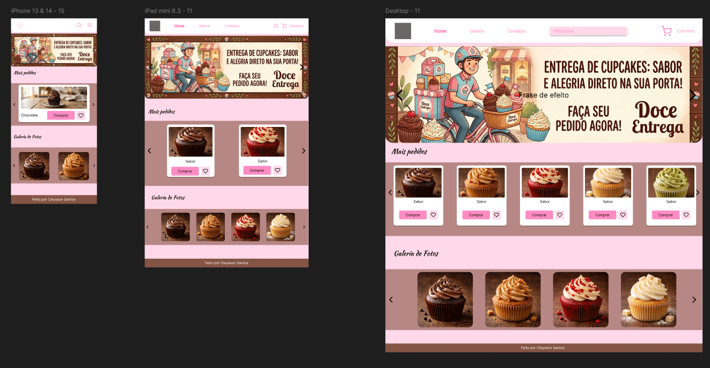

# 🧁 Doce Encantado

Uma loja virtual responsiva para venda de cupcakes, desenvolvida com foco em uma experiência moderna e intuitiva.

A ideia surgiu de um trabalho da faculdade onde era pra fazer apenas o Wireframe das telas. Então decidi colocar meus conhecimentos em prática para aperfeiçoar minhas habilidades de Front-end.

## 📷 Preview



## 🚀 Funcionalidades

- ✅ Página inicial responsiva
- ✅ Listagem de produtos
- ✅ Sistema de busca
- ✅ Filtro por categorias
- ✅ Carrinho de compras
- ✅ Layout Mobile First
- ✅ Navegação intuitiva

## 🛠️ Tecnologias

- HTML5
- CSS3
- JavaScript
- Git
- GitHub

## 📱 Responsividade

O projeto foi desenvolvido utilizando a abordagem **Mobile First**, garantindo uma boa experiência em:

- 📱 Smartphones
- 💻 Notebooks
- 🖥️ Desktops

## 📂 Estrutura do projeto

```text
📦 doce-encantado
 ┣ 📂 assets
 ┃ ┣ 📂 css
 ┃ ┣ 📂 images
 ┃ ┗ 📂 js
 ┣ 📜 index.html
 ┣ 📜 README.md
 ┗ 📜 LICENSE
```

## ▶️ Como executar

1. Clone este repositório

```bash
git clone https://github.com/seuusuario/doce-encantado.git
```

2. Entre na pasta

```bash
cd doce-encantado
```

3. Abra o arquivo `index.html` no navegador.

## 🎯 Objetivo

Este projeto foi desenvolvido para praticar conceitos de desenvolvimento Front-end, incluindo HTML semântico, CSS responsivo e JavaScript para interação do usuário.

## 📸 Screenshots

### Home

(coloque uma imagem)

### Produtos

(coloque outra imagem)

### Carrinho

(coloque outra imagem)

## 🔗 Demonstração

GitHub Pages:

https://seuusuario.github.io/doce-encantado/

## 👨‍💻 Autor

**Cleysson Santos**

LinkedIn:
https://linkedin.com/in/cleysson-santos

GitHub:
https://github.com/seugithub